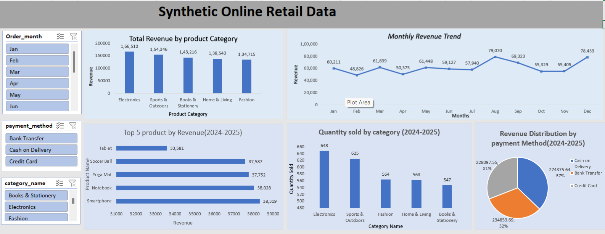

# 📊 Synthetic online retail Sales Performance Analysis

## 📌 Project Overview
The **Synthetic online retail Sales Performance Analysis** project focuses on analyzing a retail sales dataset using Microsoft Excel.  
The dataset contained **1000+ rows** and **11 original columns**. The data was cleaned, transformed, and enhanced by creating additional columns to generate meaningful business insights and visualize sales performance effectively.

---

## 🛠️ Data Cleaning & Transformation
During the preprocessing stage, the dataset was cleaned and optimized for analysis. Additional calculated columns were created, including:

- Order Month
- Revenue
- Age Group

These transformations helped improve data organization and enabled deeper sales analysis.

---

## 📈 Analysis & Visualizations
Several pivot tables, charts, and visual reports were created to analyze different aspects of sales performance, including:

- Monthly Revenue Trend
- Revenue by Product Category
- Top 5 Products by Revenue
- Revenue Distribution by Payment Method
- Quantity Sold by Category
- Revenue by Age Group

---

## 📊 Interactive Dashboard
An interactive Excel dashboard was designed using:

- Slicers
- Filters
- Pivot Charts
- Pivot Tables

The dashboard provides a dynamic and user-friendly way to explore sales insights and trends.

---

## 🔍 Key Insights

- Electronics category generated the highest revenue.
- Smartphones were among the top-performing products.
- Cash on Delivery (COD) contributed a major share of transactions.
- Revenue trends showed fluctuations across different months.
- Category analysis helped identify high-demand products.

---

## 🧰 Tools Used

- Microsoft Excel
- Pivot Tables
- Pivot Charts
- Data Cleaning
- Slicers & Filters
- Dashboard Design

---

## 📂 Project Files

- Cleaned Excel Dataset
- Pivot Tables & Charts
- Interactive Dashboard
- Dashboard Screenshot

---

## 📷 Dashboard Preview

---

## 💡 Conclusion
This project demonstrates how Excel can be used for data cleaning, sales analysis, and dashboard creation to extract actionable business insights from retail sales data.
